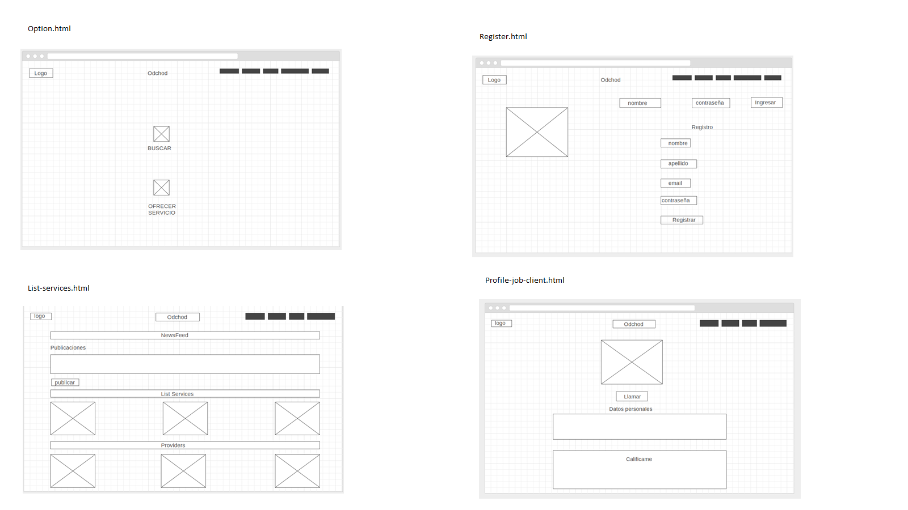
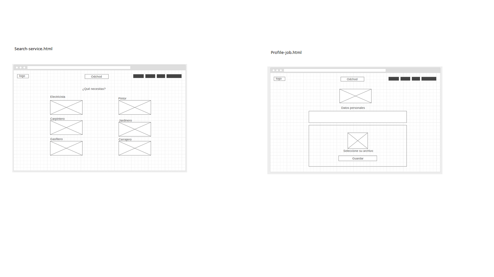

## Obchod
Nosotros somos una plataforma de red social de oficios. Si tienes un oficio que presentar y/ó buscas una persona que te preste un servicio, este es el lugar.

### Proyecto desarrollado en [Laboratoria](http://laboratoria.la)

### En  [Peru](http://peru.com)

## Reto
- Creación de una Red Social

## Problema
- Ausencia de una Red Social exclusiva para ofertar oficios, demandar servicios y anunciar productos relacionados.

- ¿Encuentras fácilmente personas con oficio? ¿Si tienes un oficio, donde lo publicas?

## Solución

- Red Social de Oficios: Obchod.

- Obchod!

- Obchod, es una Red Social, con accesibilidad vía web ( link gh-pages ) y mobile, que tiene la finalidad de facilitar los puntos de contactos entre: personas que tienen un oficio, clientes que solicitan  servicios y proveedores que ofertan sus productos relacionados.

- Features

Vista | Persona con Oficio | Persona que solicita servicios
 ------- | ----- | ----------- 
Profile | Datos de identificación, de contacto y portafolio|  Datos de usuario y contacto
Vista Oficios| Muestra los oficios, posibilidad de búsqueda| Muestra los oficios, posibilidad de búsqueda
Vista Home| Revisa publicaciones de solicitud de servicios | Postea publicaciones de solicitud de servicios
Sección de calificaciones | Muestra las calificaciones recibidas y recomendaciones | Califica y recomienda

- Demo: Web Responsive 

https://yennyelizabeth.github.io/red-social/

## Contribuidores
Equipo "Networking Girls"
- Lara Aspilcueta, Betsy Dessire - betsy_dessire@hotmail.com
- Yenny Elizabeth  
- Yauri Machaca , Melissa Rossmery - yaurimelissa@gmail.com

## Proceso

- Descubrimiento
- Empatía
 
Se han identificado la historia real de un electricita, y a través de entrevistas se han identificado sus necesidades.

 
 
 

Se identificaron las metas y deseoos  del electricista, cliente y proveedor.

Electricista |    Cliente   | Proveedor
------------ | -------------|--------------
Aumentar contactos con clientes | visualizar perfiles|más clientes reducir el tiempo de contacto| recibir , calificar y recomendar un buen servicio| conocer los anuncios de los proveedores rápidamente|ubicar rápidamente|que conozcan rápidamente la información de sus productos.|

- Definición
Falta de punto de contacto entre personas que tienen un oficio, clientes y proveedores
Ausencia de una Red Social de Oficios.

- Ideación
Una red social mediante Una web responsive.

- Prototipo

- [Prueba](#prueba)

### Herramientas

Css
Javascript
Jquery
Boostrap
Html
Markdown

### Documentación

- Planning

Trello  [Planificación en trello]( https://trello.com/b/sJzBGeGU/red-social-de-oficios")

- Research

Modelo Cuestionario de Entrevista Presencial a Electricista
  
  

Modelo Cuestionario de Encuesta a Posibles Clientes
  [Encuesta]( https://goo.gl/forms/7RBTRfiR6nP1VR2v2 "Encuestando a Posibles Clientes").

Modelo Cuestionario de Entrevista Presencial a Posibles Proveedores
  

* Entrevista Presencial a Electricista
  Se le hizo 3 entrevistas a un mismo Electricista,
  Se prepararon 3 grupos de preguntas
  Se obtuvieron las siguientes primeras conclusiones

* Encuesta Online a Posibles Clientes:
  Se encuestó a 27 personas
  Teniendo los siguientes resultados

  
  

* Metas y Deseos ( electricista, cliente y proveedor)

Electricista |    Cliente   | Proveedor
------------ | -------------|--------------
Aumentar contactos con clientes | visualizar perfiles|más clientes
reducir el tiempo de contacto| recibir , calificar y recomendar un buen servicio|
conocer los anuncios de los proveedores rápidamente|ubicar rápidamente|que conozcan rápidamente la información de sus productos.

* Red Sociales laborales

Facebook
Linkdln
Aptitus.com
Computrabajo.com
Laborum.com

- Versiones

### Feedback
- Comunicarse con el grupo a los emails señalados, todo feedback será bien recibido.

